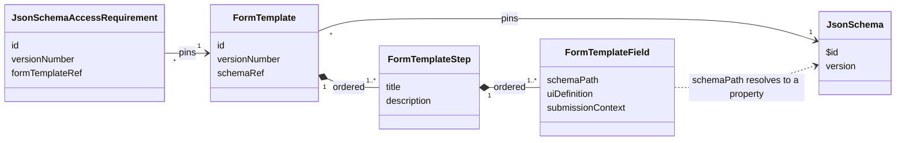
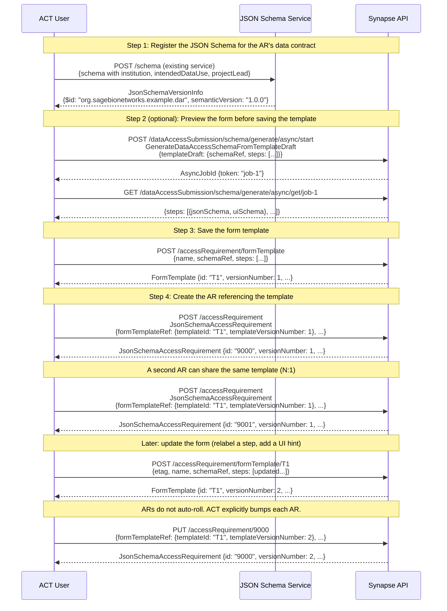
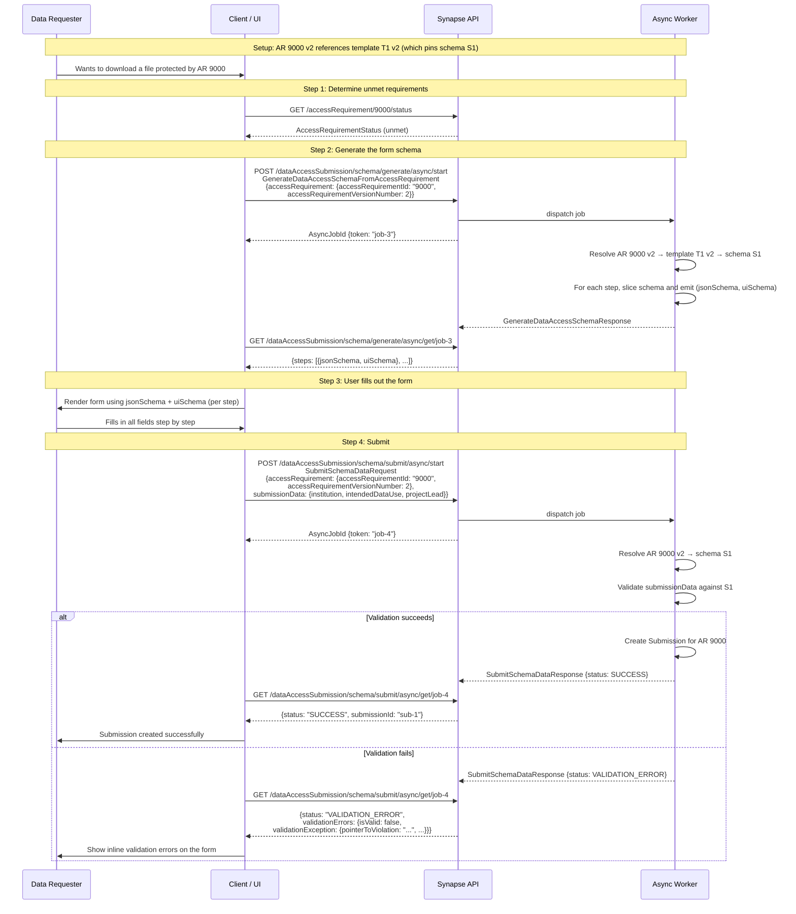

Corresponding ticket: [PLFM-9449](https://sagebionetworks.jira.com/browse/PLFM-9449)

This document describes extending the Synapse API so Access Requirements (ARs) can describe additional, flexible information that must be collected from end users in data access requests. The solution provides services that facilitate managing the AR questionnaires.

The proposed solution involves adding new services for the Synapse Access and Compliance Team (ACT) to create and manage 'form template' objects, which describe how a registered JSON Schema is rendered to requesters as a multi-step form. A new Access Requirement type is added that references both a registered JSON Schema (the data contract) and a form template (the presentation). New services facilitate generating a JSON Schema and UI Schema for such an access requirement, which can be presented to a user as a form with validation rules when they initiate a data access request.

## Background

Sensitive data in Synapse can be protected using one or more Access Requirements (ARs). When an AR is applied to a resource (e.g. FileEntity) in Synapse, end users must meet the terms of the AR to access the resource (e.g., download the file). Many ARs are "Managed" ARs, where information is collected from a requester in a "Data Access Request" (DAR). The DAR is then reviewed by a Data Access Committee (DAC). Using the information provided by the requester, the committee may approve or reject the DAR. Requester(s) meet the terms of the AR when their corresponding DAR is approved.

While many of our projects have diverse governance and data adjudication needs, Access Requirements currently only support prompting a requester with a subset of predefined questions, which makes it difficult to gather and review specific information from data requesters. To better support these scenarios, we propose a design that extends the existing Access Requirement/Data Access Request flow to use JSON Schema to describe additional information to gather in an Data Access Request.

For more information and use case information, see [PSI-1](https://sagebionetworks.jira.com/browse/PSI-1) and [TECH-184](https://sagebionetworks.jira.com/browse/TECH-184).

### Goals

- Extend access requirement and data access submission services to collect custom data within the existing data access request flow
- For a given Access Requirement, ACT can describe additional form data that should be collected in a data access request.
- Custom information is gathered via a form presented to requester
  - ACT can provide an optional 'UI Schema' to customize form appearance
  - Support custom attachments (form fields with type `file`)
  - Form can be split into multiple steps to simplify and streamline interface for requesters
- Submission reviewers can review custom form data
- Requesters can save partial form progress and resume in a later session
- Add a path to using schemas for existing Access Requirements/approvals (support a one-time migration step from the existing `ManagedACTAccessRequirement`)
- Reviewer and submitter can export a PDF of the created submission (client side logic)

### Non-Goals

See [PSI-1](https://sagebionetworks.jira.com/browse/PSI-1).

- Supporting all types of form data (e.g. nested objects)
- Conditional logic (see Appendix)
- Enabling interoperability with other platforms (see Appendix)
- Coalescing requests to multiple ARs into one form (see Appendix)

## Proposal Summary

Today, every Managed ACT Access Requirement collects the same fixed set of fields from a data requester. If a project requires asking for additional information not captured by the Managed ACT Access Requirement, there's no way to capture it inside the standard DAR flow. Workarounds exist, such as asking users to upload additional files described in the wiki, or requiring a specific format for the "Intended Data Use" statement, but data requesters often fail to properly follow these instructions.

This proposal extends the AR/DAR flow so ACT can attach a registered JSON Schema (the data contract for the request) and a Form Template (the presentation layer that maps schema properties to UI) to an Access Requirement. A requester's answers are validated against that schema, stored on the Submission, and presented to reviewers as a structured form. A new AR type (`JsonSchemaAccessRequirement`) utilizes this behavior; existing `ManagedACTAccessRequirement`s continue to work unchanged unless ACT explicitly migrates them.

### Summary of New Objects and Services

- **JSON Schema** describes the shape of the data collected from a requester, including per-property type, validation rules, and which properties are required. Schemas are registered and versioned in the existing Synapse JSON Schema registry. Multiple Access Requirements may reference the same schema.
- `FormTemplate` is a versioned, ACT-managed object that defines how a referenced JSON Schema is rendered as a multi-step form. It carries an ordered list of steps (display title, description), and within each step, an ordered list of field slots. Each field slot binds a JSON pointer into the schema to a UI definition (and, for file-upload fields, a template file handle). A template is pinned to one schema version; updating a template creates a new template version. Multiple Access Requirements may reference the same `FormTemplate` (N:1).
- `JsonSchemaAccessRequirement` is a new AR type that references a `FormTemplate` (by id and version). The template's pinned schema is the AR's data contract — there is no separate schema reference on the AR. Otherwise behaves like `ManagedACTAccessRequirement` (same accessor flow, expirations, approvals).
- Schema generation service resolves the AR's `FormTemplate` and the schema it references, and emits a per-step (jsonSchema, uiSchema) bundle. The UI uses this bundle to render the form for requesters or as a read-only display for reviewers. The same service can render a draft template body to support previewing during template authoring.
- Schema submission service accepts the requester's answers, validates them against the schema referenced by the AR's pinned template (filtered by the active `requestType`), and creates a Submission whose `schemaData` holds the validated payload.
- Schema draft service lets requesters save partial form progress per (user, AR) and resume in a later session. Drafts hold unvalidated partial data; validation runs only at submit time.
- For `JsonSchemaAccessRequirement`, `submissionData` (and its draft) replaces the existing `ResearchProject` snapshot — institution, project lead, intended-data-use, and any other previously-fixed fields are now expressed as schema properties. Reviewer UI for these submissions reads from `schemaData` instead of `researchProjectSnapshot`. The migration step (see below) copies existing `ResearchProject` data into `schemaData` for past submissions.

### Example Workflow

ACT registers a JSON Schema in the existing schema registry that captures the data contract for an AR. They author a `FormTemplate` that pins to that schema and arranges its properties into one or more steps with UI hints. They preview the resulting form, save the template, and create a `JsonSchemaAccessRequirement` that references the template. Updating the form (renaming a step, regrouping fields, changing UI hints) is a single transactional update to the template; updating the data contract (changing types, adding/removing properties, changing validation) is a schema bump (which requires publishing a new template version pinned to the new schema). Updates to a template do not automatically cascade to ARs that reference it; ACT explicitly bumps an AR to a new template version.

Requester side: When a user wants access to a resource gated by a `JsonSchemaAccessRequirement`, the client calls the schema generation service for that AR version. The response is a multi-step JSON Schema + UI Schema bundle. The user fills out the form one step at a time and submits. The submission service validates the payload against the schema pinned by the AR version and either creates the Submission or returns structured validation errors.

Reviewer side: A DAC reviewer opens a submission as they do today. The submission carries `schemaData` plus a reference to the AR version it was submitted against; the UI re-runs schema generation for that AR version to render a read-only form filled with the requester's answers. The reviewer adjudicates the submission the same as they would adjudicate a submission against a `ManagedACTAccessRequirement`.

## API Design

We propose adding the following new services and new/changed objects.

### Services

| Endpoint                                                         | Request Body                             | Response                         | Notes                                                                                                                                                                                                                                                                                                                                                                                                                                                                                                                                                                                                                                                                                                                                                                                                        | Authorization Required |
| ---------------------------------------------------------------- | ---------------------------------------- | -------------------------------- | ------------------------------------------------------------------------------------------------------------------------------------------------------------------------------------------------------------------------------------------------------------------------------------------------------------------------------------------------------------------------------------------------------------------------------------------------------------------------------------------------------------------------------------------------------------------------------------------------------------------------------------------------------------------------------------------------------------------------------------------------------------------------------------------------------------ | ---------------------- |
| POST /accessRequirement/formTemplate                             | FormTemplate                             | FormTemplate                     | Used to create a form template. The submitted body must include a `schemaRef` pointing to a registered JSON Schema version. At create time, the system validates that (1) every field slot's `schemaPath` resolves to a leaf property in the resolved schema, (2) every property declared `required` in the schema is covered by exactly one field slot, (3) no two field slots share the same `schemaPath`, and (4) each slot's UI hints are compatible with its target property's type/format. Validation failures return a structured error and no template is created.                                                                                                                                                                                                                                   | ACT only               |
| POST /accessRequirement/formTemplate/{id}                        | FormTemplate                             | FormTemplate                     | Used to update a form template by its ID. Templates are versioned and immutable per version; any change creates a new version. The update is validated against the new body's `schemaRef` using the same rules as create. ARs that reference this template do **not** automatically roll forward; ACT explicitly bumps an AR by updating it to reference the new template version.                                                                                                                                                                                                                                                                                                                                                                                                                           | ACT only               |
| GET /accessRequirement/formTemplate/{id}                         | None                                     | FormTemplate                     | Used to retrieve the latest version of a form template by its ID.                                                                                                                                                                                                                                                                                                                                                                                                                                                                                                                                                                                                                                                                                                                                            | None                   |
| GET /accessRequirement/formTemplate/{id}/version/{versionNumber} | None                                     | FormTemplate                     | Used to retrieve a specific version of a form template.                                                                                                                                                                                                                                                                                                                                                                                                                                                                                                                                                                                                                                                                                                                                                      | None                   |
| POST /accessRequirement/formTemplate/search                      | FormTemplateSearchRequest                | FormTemplateSearchResponse       | Search all registered form templates in the system. Only the latest versions of templates are returned.                                                                                                                                                                                                                                                                                                                                                                                                                                                                                                                                                                                                                                                                                                      | None                   |
| POST /dataAccessSubmission/schema/generate/async/start           | GenerateDataAccessSchemaRequestInterface | AsyncJobId                       | Given an Access Requirement ID and version (or a draft FormTemplate body for preview), generate the JSON Schema and UI Schema for the form, broken up by step.<br><br>The output is produced by resolving the source FormTemplate, resolving its referenced schema (with `$ref`s expanded), filtering field slots by `submissionContext` against the request's `requestType` (REQUEST or RENEWAL), and emitting one (jsonSchema, uiSchema) pair per step. Each step's jsonSchema slices the referenced schema to the properties targeted by that step's surviving field slots and preserves their `required` declarations (with required properties pruned if filtered out by context).                                                                                                                      | None                   |
| GET /dataAccessSubmission/schema/generate/async/get/{asyncToken} | None                                     | GenerateDataAccessSchemaResponse |                                                                                                                                                                                                                                                                                                                                                                                                                                                                                                                                                                                                                                                                                                                                                                                                              | None                   |
| POST /dataAccessSubmission/schema/submit/async/start             | SubmitSchemaDataRequest                  | AsyncJobId                       | Used to issue a submission using user-provided data that was filled in with the assistance of a schema. The server re-runs schema generation for the AR version using the request's `requestType` and validates `submissionData` against the resulting filtered schema (clients cannot bypass `required` properties by skipping a step or omitting a context-applicable property). If valid, the response includes the ID of the created submission. If invalid, no submission is created and the validation errors are returned.                                                                                                                                                                                                                                                                            | Authenticated only     |
| GET /dataAccessSubmission/schema/submit/async/get/{asyncToken}   | None                                     | SubmitSchemaDataResponse         |                                                                                                                                                                                                                                                                                                                                                                                                                                                                                                                                                                                                                                                                                                                                                                                                              | Authenticated only     |
| PUT /dataAccessSubmission/schema/draft                           | SchemaDataDraft                          | SchemaDataDraft                  | Create or update the calling user's draft for a given Access Requirement. At most one draft exists per (user, AR). Drafts are not validated against the schema — partial and invalid data is allowed so users can save progress mid-form. The draft is associated with a specific AR version; if the AR is bumped after the draft is created, clients are responsible for surfacing potential drift to the user.                                                                                                                                                                                                                                                                                                                                                                                             | Authenticated only     |
| GET /dataAccessSubmission/schema/draft/{accessRequirementId}     | None                                     | SchemaDataDraft                  | Fetch the calling user's draft for the given AR, or 404 if none exists.                                                                                                                                                                                                                                                                                                                                                                                                                                                                                                                                                                                                                                                                                                                                      | Authenticated only     |
| DELETE /dataAccessSubmission/schema/draft/{accessRequirementId}  | None                                     | None                             | Delete the calling user's draft for the given AR. Drafts are also automatically deleted when a successful submission is created.                                                                                                                                                                                                                                                                                                                                                                                                                                                                                                                                                                                                                                                                             | Authenticated only     |
| POST /accessRequirement/{id}/migrateToJsonSchema                 | None                                     | None                             | The `id` must be the ID of a ManagedACTAccessRequirement.<br><br>One-time step that registers a bootstrapped JSON Schema mirroring the existing ManagedACTAccessRequirement submission requirements, creates a corresponding bootstrapped FormTemplate, and converts the AR to a JsonSchemaAccessRequirement referencing the template. Past submissions against the AR are updated to include `schemaData` populated from each submission's existing `researchProjectSnapshot` (institution, project lead, IDU, etc.) and any other fixed fields covered by the bootstrapped schema. Rewriting historical submissions is audit-relevant and is logged accordingly.<br><br>This service initiates an eventual, asynchronous migration. The response is immediate, indicating only that migration has started. | ACT/Admin only         |
|                                                                  |                                          |                                  |                                                                                                                                                                                                                                                                                                                                                                                                                                                                                                                                                                                                                                                                                                                                                                                                              |                        |

### Objects



`org.sagebionetworks.repo.model.dataaccess.schema.FormTemplate`

```json
{
  "title": "Form Template",
  "description": "Defines how a referenced JSON Schema is rendered to a requester as a multi-step form. A template is pinned to a single JSON Schema version. Updating a template creates a new version; the schema reference and the steps/fields it contains are immutable per version. Multiple Access Requirements may reference the same template version (N:1).",
  "implements": [
    {
      "$ref": "org.sagebionetworks.repo.model.Versionable"
    }
  ],
  "properties": {
    "id": {
      "type": "string",
      "description": "The unique identifier of this template. Stable across versions."
    },
    "name": {
      "type": "string",
      "description": "The internal name of this template. Used by ACT to identify and find the template; not displayed to requesters."
    },
    "etag": {
      "type": "string",
      "description": "Synapse employs an Optimistic Concurrency Control (OCC) scheme to handle concurrent updates. Since the E-Tag changes every time a resource is updated it is used to detect when a client's current representation of a resource is out-of-date."
    },
    "schema$id": {
      "type": "string",
      "description": "Reference to the registered JSON Schema and version that this template renders. The reference MUST be pinned to a specific version. The schema is the source of truth for property types, validation rules, and which properties are required."
    },
    "steps": {
      "type": "array",
      "description": "Ordered list of steps in the form. Each step renders as a page or section. Order is determined by array position.",
      "items": {
        "$ref": "org.sagebionetworks.repo.model.dataaccess.schema.FormTemplateStep"
      }
    },
    "deprecated": {
      "type": "boolean",
      "description": "Marking a template as deprecated will hide it from search results by default. It does not affect Access Requirements that already reference this template. Default is `false`."
    }
  },
  "required": ["name", "schemaRef", "steps"]
}
```

`org.sagebionetworks.repo.model.dataaccess.schema.FormTemplateStep`

```json
{
  "title": "Form Template Step",
  "description": "A logical grouping of fields rendered as a single page or section in a multi-step form. Steps are part of the FormTemplate version; changes to a step's title, description, or contained fields produce a new template version.",
  "properties": {
    "title": {
      "type": "string",
      "description": "Display title shown to the user (e.g., 'Institutional Information')."
    },
    "description": {
      "type": "string",
      "description": "Instructions shown at the top of the page/section."
    },
    "fields": {
      "type": "array",
      "description": "Ordered list of field slots within this step. Each slot binds a JSON pointer in the schema to a UI definition.",
      "items": {
        "$ref": "org.sagebionetworks.repo.model.dataaccess.schema.FormTemplateField"
      }
    }
  },
  "required": ["title", "fields"]
}
```

`org.sagebionetworks.repo.model.dataaccess.schema.FormTemplateField`

```json
{
  "title": "Form Template Field",
  "description": "A single field slot in a form template step. Maps a JSON pointer in the referenced schema to a UI definition. Validation that the slot resolves to a real leaf property in the schema, that the slot's UI definition is compatible with the property's type/format, and that no two slots in the template share a schemaPath, is performed when the template is created or updated.",
  "properties": {
    "schemaPath": {
      "type": "string",
      "description": "JSON pointer (RFC 6901) into the template's referenced schema, identifying the leaf property this slot renders. Example: `/institution`. The pointer is resolved against the schema with `$ref`s expanded."
    },
    "uiDefinition": {
      "type": "object",
      "description": "Defines the appearance of this slot in the form UI. Defined by <a href=\"https://rjsf-team.github.io/react-jsonschema-form/docs/api-reference/uiSchema\">react-jsonschema-form</a>."
    },
    "submissionContext": {
      "type": "string",
      "enum": ["ALWAYS", "REQUEST_ONLY", "RENEWAL_ONLY"],
      "description": "Controls whether this slot appears (and the underlying schema property is collected) for an initial REQUEST, a RENEWAL, or both. Default is `ALWAYS`. The schema's `required` declaration only binds for contexts in which the property is included; if a required property is excluded for the active context, it is treated as not required."
    },
    "templateFileHandleId": {
      "type": "integer",
      "description": "A Synapse FileHandle ID used to download a template file for this slot. Intended only for slots whose target schema property uses the `synapse-filehandle-id` format. The file can be downloaded using FileHandleAssociateType.AccessRequirementAttachment."
    }
  },
  "required": ["schemaPath", "uiDefinition"]
}
```

Custom JSON Schema definition for File Handles (example for a schema property targeted by a `FormTemplateField`):

To denote a JSON Schema property as a Synapse file upload:

- it must be of `number` type
- it must use the custom format `synapse-filehandle-id`

```json
{
  "title": "Custom File Upload Field",
  "type": "number",
  "format": "synapse-filehandle-id"
}
```

The file can be downloaded via the file handle ID by using the existing `FileHandleAssociateType.DataAccessRequestAttachment`.

`org.sagebionetworks.repo.model.dataaccess.schema.FormTemplateReference`

```json
{
  "title": "Form Template Reference",
  "description": "Used to reference a specific FormTemplate id and version.",
  "properties": {
    "templateId": {
      "type": "string",
      "description": "The unique identifier of the form template."
    },
    "templateVersionNumber": {
      "type": "integer",
      "description": "The version number of the form template."
    }
  },
  "required": ["templateId", "templateVersionNumber"]
}
```

`org.sagebionetworks.repo.model.dataaccess.schema.FormTemplateSearchRequest`

```json
{
  "title": "Form Template Search Request",
  "description": "A request body to search form templates. Only the latest versions of form templates can be retrieved.",
  "properties": {
    "name": {
      "type": "string",
      "description": "Filter by the internal name of the FormTemplate using case-insensitive substring matching."
    },
    "includeDeprecated": {
      "type": "boolean",
      "description": "Whether to include deprecated templates in the results. Default is `false`."
    },
    "nextPageToken": {
      "type": "string",
      "description": "A token used to get the next page of a request."
    }
  }
}
```

`org.sagebionetworks.repo.model.dataaccess.schema.FormTemplateSearchResponse`

```json
{
  "title": "Form Template Search Response",
  "description": "A response body containing form template search results.",
  "properties": {
    "results": {
      "type": "array",
      "items": {
        "$ref": "org.sagebionetworks.repo.model.dataaccess.schema.FormTemplate"
      },
      "description": "The matching Form Templates corresponding to the search parameters."
    },
    "nextPageToken": {
      "type": "string",
      "description": "A token used to get the next page of a particular search query."
    }
  }
}
```

`org.sagebionetworks.repo.model.dataaccess.schema.GenerateDataAccessSchemaRequestInterface`

```json
{
  "title": "Generate Data Access Schema Request",
  "type": "interface",
  "description": "Request body to generate the JSON Schema and UI Schema for a form.",
  "implements": [
    {
      "$ref": "org.sagebionetworks.repo.model.asynch.AsynchronousRequestBody"
    }
  ],
  "properties": {
    "requestType": {
      "type": "string",
      "description": "The type of request being made. May affect the final set of included form fields.",
      "enum": ["REQUEST", "RENEWAL"]
    },
    "concreteType": {
      "type": "string",
      "description": "Indicates which implementation this object represents."
    }
  },
  "required": ["concreteType", "requestType"]
}
```

`org.sagebionetworks.repo.model.dataaccess.schema.GenerateDataAccessSchemaFromAccessRequirement`

```json
{
  "title": "Generate Data Access Schema From Access Requirement",
  "description": "Request body to generate the JSON Schema and UI Schema for a form. Intended to support data requesters in the data access request flow.",
  "implements": [
    {
      "$ref": "org.sagebionetworks.repo.model.dataaccess.schema.GenerateDataAccessSchemaRequestInterface"
    }
  ],
  "properties": {
    "accessRequirement": {
      "$ref": "org.sagebionetworks.repo.model.AccessRequirementReference",
      "description": "The AR ID and version number used to generate a schema to describe a data access request."
    }
  },
  "required": ["accessRequirement"]
}
```

`org.sagebionetworks.repo.model.dataaccess.schema.GenerateDataAccessSchemaFromTemplateDraft`

```json
{
  "title": "Generate Data Access Schema From Template Draft",
  "description": "Request body to generate the JSON Schema and UI Schema from a draft FormTemplate body. Intended to support previewing the rendered form during template authoring.",
  "implements": [
    {
      "$ref": "org.sagebionetworks.repo.model.dataaccess.schema.GenerateDataAccessSchemaRequestInterface"
    }
  ],
  "properties": {
    "templateDraft": {
      "$ref": "org.sagebionetworks.repo.model.dataaccess.schema.FormTemplate",
      "description": "The draft template body to render. The draft is validated against its schemaRef using the same rules applied at template create/update time. The draft is not persisted."
    }
  },
  "required": ["templateDraft"]
}
```

`org.sagebionetworks.repo.model.dataaccess.schema.GenerateDataAccessSchemaResponse`

```json
{
  "title": "Generate Data Access Schema Response",
  "description": "Response body for a Generate Data Access Schema request. Returns one (jsonSchema, uiSchema) pair per step in the source FormTemplate.",
  "implements": [
    {
      "$ref": "org.sagebionetworks.repo.model.asynch.AsynchronousResponseBody"
    }
  ],
  "properties": {
    "steps": {
      "type": "array",
      "description": "An ordered list of schema information used to render the form, one element per step in the source template. Each element's jsonSchema validates the slice of submission data corresponding to that step's fields.",
      "items": {
        "type": "object",
        "properties": {
          "jsonSchema": {
            "$ref": "org.sagebionetworks.repo.model.schema.JsonSchema"
          },
          "uiSchema": {
            "type": "object"
          }
        },
        "required": ["jsonSchema", "uiSchema"]
      }
    }
  },
  "required": ["steps"]
}
```

`org.sagebionetworks.repo.model.dataaccess.schema.SubmitSchemaDataRequest`

```json
{
  "title": "Submit Schema Data Request",
  "description": "Request body to create a submission using user-provided data validated against the JSON Schema referenced by the AR's pinned FormTemplate.",
  "implements": [
    {
      "$ref": "org.sagebionetworks.repo.model.asynch.AsynchronousRequestBody"
    }
  ],
  "properties": {
    "accessRequirement": {
      "$ref": "org.sagebionetworks.repo.model.AccessRequirementReference",
      "description": "The Access Requirement ID and version number for which a data access request should be created."
    },
    "requestType": {
      "type": "string",
      "enum": ["REQUEST", "RENEWAL"],
      "description": "Whether this submission is an initial request or a renewal. Used to filter form template fields by their `submissionContext` and produce the schema against which `submissionData` is validated."
    },
    "submissionData": {
      "type": "object",
      "description": "The data that the user provided. Must be valid against the JSON Schema referenced by the AR version's pinned FormTemplate, filtered by the active `requestType`. Property keys correspond to top-level property names defined in that schema."
    },
    "accessorChanges": {
      "type": "array",
      "description": "List of user changes. Users can only gain access via this submission flow.",
      "items": {
        "$ref": "org.sagebionetworks.repo.model.dataaccess.AccessorChange"
      }
    },
    "subjectId": {
      "type": "string",
      "description": "The ID of the subject user interested in. This information will be used to help user navigate back to where they were to continue their work."
    },
    "subjectType": {
      "$ref": "org.sagebionetworks.repo.model.RestrictableObjectType",
      "description": "The type of the subject user interested in. This information will be used to help user navigate back to where they were to continue their work."
    }
  },
  "required": [
    "accessRequirement",
    "requestType",
    "submissionData",
    "accessorChanges"
  ]
}
```

`org.sagebionetworks.repo.model.dataaccess.schema.SubmitSchemaDataResponse`

```json
{
  "title": "Submit Schema Data Response",
  "description": "Response body representing the result of a submit schema data request. A request either results in creation of a submission, or a set of schema validation errors.",
  "implements": [
    {
      "$ref": "org.sagebionetworks.repo.model.asynch.AsynchronousResponseBody"
    }
  ],
  "properties": {
    "status": {
      "$ref": "org.sagebionetworks.repo.model.dataaccess.schema.SubmitSchemaDataResultStatus"
    },
    "submissionId": {
      "type": "string",
      "description": "The data access submission ID that was created as a result of the request."
    },
    "validationErrors": {
      "$ref": "org.sagebionetworks.repo.model.dataaccess.schema.SubmissionValidationResult",
      "description": "The validation errors that were encountered that prevent creating submissions."
    }
  },
  "required": ["status"]
}
```

`org.sagebionetworks.repo.model.dataaccess.schema.SchemaDataDraft`

```json
{
  "title": "Schema Data Draft",
  "description": "A user's saved, in-progress submission for a JsonSchemaAccessRequirement. Drafts allow filling out a multi-step form across multiple sessions. At most one draft exists per (user, AR). Drafts hold partial, unvalidated data; validation runs only on submit.",
  "properties": {
    "accessRequirement": {
      "$ref": "org.sagebionetworks.repo.model.AccessRequirementReference",
      "description": "The AR ID and version this draft was started against. Used by clients to detect AR drift since the draft was created."
    },
    "requestType": {
      "type": "string",
      "enum": ["REQUEST", "RENEWAL"],
      "description": "Whether this draft is for an initial request or a renewal."
    },
    "submissionData": {
      "type": "object",
      "description": "Partial submission data. Property keys correspond to top-level property names in the AR's pinned schema. Not validated against the schema until submit time."
    },
    "accessorChanges": {
      "type": "array",
      "description": "List of user changes captured so far.",
      "items": {
        "$ref": "org.sagebionetworks.repo.model.dataaccess.AccessorChange"
      }
    },
    "subjectId": {
      "type": "string",
      "description": "The ID of the subject the user is interested in."
    },
    "subjectType": {
      "$ref": "org.sagebionetworks.repo.model.RestrictableObjectType",
      "description": "The type of the subject the user is interested in."
    },
    "modifiedOn": {
      "type": "string",
      "format": "date-time",
      "description": "The last time this draft was saved."
    }
  },
  "required": ["accessRequirement", "requestType"]
}
```

`org.sagebionetworks.repo.model.dataaccess.schema.SubmitSchemaDataResultStatus`

```json
{
  "title": "Submit Schema Data Result Status",
  "description": "Status of a Submit Schema Data Response",
  "type": "string",
  "enum": [
    {
      "name": "SUCCESS",
      "description": "A submission was successfully created using the attached data."
    },
    {
      "name": "VALIDATION_ERROR",
      "description": "Submitted data was invalid against the schema. No submission was created."
    }
  ]
}
```

`org.sagebionetworks.repo.model.dataaccess.schema.SubmissionValidationResult`

Note: all of these objects fields also exist in `org.sagebionetworks.repo.model.schema.ValidationResults`. We are likely to instead factor out an interface that describes these properties and reuse it in both implementations.

```json
{
  "title": "Submission Validation Result",
  "description": "Represents the JSON Schema validation results of a SubmitSchemaDataResponse.",
  "properties": {
    "isValid": {
      "type": "boolean",
      "description": "True if the object is currently valid according to the schema."
    },
    "validatedOn": {
      "type": "string",
      "format": "date-time",
      "description": "The date-time this object was validated"
    },
    "validationErrorMessage": {
      "type": "string",
      "description": "If the object is not valid according to the schema, a simple one line error message will be provided."
    },
    "allValidationMessages": {
      "description": "If the object is not valid according to the schema, a the flat list of error messages will be provided with one error message per sub-schema.",
      "type": "array",
      "items": {
        "type": "string"
      }
    },
    "validationException": {
      "description": "If the object is not valid according to the schema, a recursive ValidationException will be provided that describes all violations in the sub-schema tree.",
      "$ref": "org.sagebionetworks.repo.model.schema.ValidationException"
    }
  }
}
```

`org.sagebionetworks.repo.model.AccessRequirementReference`

```json
{
  "title": "Access Requirement Reference",
  "description": "Used to reference a specific access requirement and version.",
  "properties": {
    "accessRequirementId": {
      "type": "string",
      "description": "The unique identifier of this access requirement."
    },
    "accessRequirementVersionNumber": {
      "type": "integer",
      "description": "The version number of this access requirement."
    }
  },
  "required": ["accessRequirementId", "accessRequirementVersionNumber"]
}
```

`org.sagebionetworks.repo.model.HasExpiration`

- interface factored out of `ManagedACTAccessRequirement` for reuse

```json
{
  "title": "Has Expiration",
  "type": "interface",
  "description": "Used to describe an access requirement for which AccessApprovals will expire after some duration.",
  "properties": {
    "expirationPeriod": {
      "type": "integer",
      "description": "After an AccessApproval is granted for this AccessRequirement, it will be expired after expirationPeriod milliseconds. Set this value to 0 to indicate that AccessApproval will never be expired."
    }
  }
}
```

`org.sagebionetworks.repo.model.JsonSchemaAccessRequirement`

```json
{
  "title": "JSON Schema Access Requirement",
  "description": "A Synapse 'Access Control Team' controlled Access Requirement, a 'tier 3' Access Requirement. In addition to the functionality provided by the Managed ACT Access Requirement, this Access Requirement type also supports collecting information described by a JSON Schema and rendered using a FormTemplate. The data contract (JSON Schema) is resolved transitively through the referenced FormTemplate.",
  "implements": [
    {
      "$ref": "org.sagebionetworks.repo.model.ACTAccessRequirementInterface"
    },
    {
      "$ref": "org.sagebionetworks.repo.model.HasAccessorRequirement"
    },
    {
      "$ref": "org.sagebionetworks.repo.model.HasExpiration"
    }
  ],
  "properties": {
    "formTemplateRef": {
      "$ref": "org.sagebionetworks.repo.model.dataaccess.schema.FormTemplateReference",
      "description": "Reference to the FormTemplate version used to render the form for this AR. The template's pinned schema is the AR's data contract. Multiple ARs may reference the same FormTemplate version."
    }
  },
  "required": ["formTemplateRef"]
}
```

`org.sagebionetworks.repo.model.dataaccess.Submission`

The submission already includes the `accessRequirementId` and `accessRequirementVersion`, which can be used to get the schema this data was submitted against. For reviewers, the UI can display a 'read-only' version of the schema form filled in with the `schemaData`.

For submissions created against a `JsonSchemaAccessRequirement`:

- `schemaData` carries the validated submission payload.
- `requestId` is null — JsonSchema-based submissions do not use the legacy `Request` lifecycle. Drafts are managed via the schema draft service instead.
- `researchProjectSnapshot` is null — its fields (institution, project lead, IDU, etc.) are now expressed as schema properties and live inside `schemaData`. The migration step backfills `schemaData` for historical ManagedACT submissions from their `researchProjectSnapshot`.

```json
{
  "description": "A submission to request access to controlled data.",
  "properties": {
    // Existing properties omitted for brevity
    "schemaData": {
      "type": "object",
      "description": "Additional data provided by the submitter, validated against the JSON Schema referenced by the AR version recorded on this submission. Property keys correspond to top-level property names defined in that schema."
    }
  }
}
```

### Sequence Diagram Examples





## UI Mockups

The following images are for demonstration purposes only and are subject to change. They may be out-of-date as this design is updated.
![[Pasted image 20260506134426.png]]

## Open Questions

- Access Requirement updates can now substantially impact the submission requirements (new properties or validation rules may be added, the form layout may be reorganized, etc). How should we handle the following sequence?
  1.  User begins to fill out the data access request form for AR 123, v4 (with a saved draft).
  2.  AR 123 is updated to v5, which references a new schema or template version that adds required properties.
  3.  User creates the submission with AR 123 v4 data.
      - Should the submission be accepted for review by the system? Should we only allow submission against the latest version of the AR (forcing the user to restart)?
      - What about the case where the submission is created, but has not been reviewed, before the AR update?
      - How should the draft service surface drift? (Likely the UI compares the draft's `accessRequirement.accessRequirementVersionNumber` against the current AR version and warns the user, but the contract should be explicit.)
- **Per-property publication policy**. The legacy `ManagedACTAccessRequirement.isIDUPublic` flag designated whether the IDU statement could be disclosed publicly. Under the schema-based model, individual schema properties (not just the IDU) could be flagged as publicly disclosable. Recommendation: treat this as out-of-scope for the REST API; the data should be retrieved from the data warehouse and exposed via a Synapse Table (similar to the data catalog and other similar data)

## Appendix

### GA4GH Passport Visa

The research spike ticket includes the following "bonus" acceptance criteria":

> Assess whether JSON submission can be stored/exchanged on Passport Visa

My assessment is that form responses _could technically_ be encoded in a GA4GH Passport [Custom Visa](https://github.com/ga4gh-duri/ga4gh-duri.github.io/blob/master/researcher_ids/ga4gh_passport_v1.md#custom-visa-types), which is a signed JWT. However, this may not be the best approach to disseminating access request responses. For example, the set of user responses could be very large. Using the Visa protocol to disseminate this kind of information seems counter to the intent of the specification.

### Extension: Conditional Logic and Dynamic Requiredness

At a later date, we could extend the schema/template model to capture richer behaviors that are out of scope for v1:

- Conditional logic (show/hide a property based on other answers)
- Dynamically changing the 'requiredness' of a property based on other answers
- Cross-property validation (e.g. one of two properties must be filled in)

These would likely be expressed in the JSON Schema (using `if`/`then`/`else`, `oneOf`, etc.) with the FormTemplate's UI hints adapting to the schema's conditional structure.

### Extension: Streamlined/Deduplicated Form

A future extension lets a requester applying to multiple ARs fill out one merged form. The v1 design enables this without breaking changes — the cases below describe what the extension would handle.

**Case 1 — same FormTemplate.** ARs sharing a template share a schema and a form. We display a single form, validate against the shared schema, and create one Submission per AR.

**Case 2 — different templates, overlapping questions.** AR1 asks A, B, C; AR2 asks A, B, D; merged form asks A–D once. Question identity is determined by using the same `$ref`s to a registered sub-schema: properties `$ref`'d from the same sub-schema dedupe; properties defined inline do not. Fields without a shared `$ref` are asked once per AR. The client is responsible for facilitating subschema reuse.

We must still decide how to handle UI hint conflicts and step ordering mismatches, but it seems reasonable to just take the first value.
