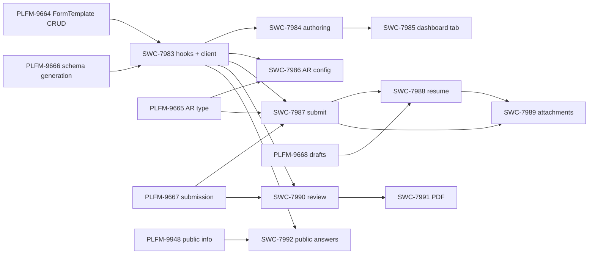

# Flexible (JSON Schema) Access Requirements — Frontend Plan

Working document for breaking the frontend work into SWC tickets, and for realigning the backend tickets with the design doc. Design: [JSON Schema-based Access Requirements](https://sagebionetworks.jira.com/wiki/spaces/PLFM/pages/4585324546/JSON+Schema-based+Access+Requirements) (v26; mirrored at `designs/FormTemplate.md`). Product epic: PSI-1.

**The design doc is the source of truth.** Several backend tickets were written against an earlier draft that proposed new schema-specific services. That draft predates eDUC; because eDUC builds on the existing data access request services and must also work for JSON Schema ARs, the doc was revised to reuse existing services and drop the proposed new ones. The tickets did not follow. Corrections are in [Backend realignment](#backend-realignment).

## Current state

### Backend (children of PSI-1)

| Ticket    | Summary                                           | Status         | Assignee          | Needs change        |
| --------- | ------------------------------------------------- | -------------- | ----------------- | ------------------- |
| PLFM-9449 | Research spike (backend)                          | Closed         | Nick Grosenbacher | No                  |
| PLFM-9751 | Spike: publicly viewable fields                   | Resolved       | Nick Grosenbacher | No                  |
| PLFM-9663 | POJOs + JSON Schemas for schema-based DAR objects | Closed         | Sandhra Sokhal    | Record-only         |
| PLFM-9664 | FormTemplate CRUD and search service              | Resolved       | Sandhra Sokhal    | No                  |
| PLFM-9665 | `JsonSchemaAccessRequirement` AR type             | Ready for Team | Sandhra Sokhal    | No                  |
| PLFM-9666 | Schema generation service                         | Ready for Team | _unassigned_      | Yes — restore async |
| PLFM-9667 | Schema-based submission service                   | Ready for Team | _unassigned_      | **Yes — rewrite**   |
| PLFM-9668 | Schema-based submission draft service             | Ready for Team | _unassigned_      | **Yes — rewrite**   |
| PLFM-9669 | One-time `ManagedACT` → `JsonSchema` AR migration | Ready for Team | _unassigned_      | Yes — drop backfill |
| SWC-7688  | Research spike (frontend)                         | Closed         | Jay Hodgson       | No                  |

**In-flight risk: none.** Every ticket requiring a change is `Ready for Team` with **no assignee**, and none has been touched since May/June 2026 except PLFM-9667, which Nick commented on today noting the rewrite. PLFM-9665 is assigned to Sandhra Sokhal and is the likely next pickup, but it needs no content change — it already describes wiring the new AR type into the existing AR endpoints, consistent with the doc. Nothing needs to be flagged to the implementing engineer as work-in-progress being changed underneath them; the only courtesy note is that PLFM-9667/9668 will look materially different when picked up.

### What was actually built

The generated client is the reliable record of what shipped from PLFM-9663 and PLFM-9664.

Present and correct: `FormTemplate` (16 models), `FormTemplateStep`, `FormTemplateField`, `FormTemplateReference`, `FormTemplateSearchRequest`/`Response`, `JsonSchemaAccessRequirement`, `GenerateDataAccessSchema*`, `PublicSubmissionInfo*`, `AccessRequirementReference`, `HasExpiration`, `HasDataUseCertificate`, and `schemaData` on `Request`, `Renewal`, and `DataaccessSubmission`.

**Absent, and correctly so:** `SubmitSchemaDataRequest`, `SubmitSchemaDataResponse`, `SubmitSchemaDataResultStatus`, `SubmissionValidationResult`, `SchemaDataDraft`. PLFM-9663's description told the engineer to build these; they belong to the dropped earlier draft and were not built. The implementation already matches the revised doc — only the ticket text is stale.

**No operations are generated for the new endpoints.** `jq '.paths|keys[]'` finds no `formTemplate`, `schema/generate`, `migrateToJsonSchema`, or `publicSubmissionInfo` path, and `src/generated/apis/` has no FormTemplate API, even though PLFM-9664 is Resolved. A spec refresh is required before frontend work can call any of it.

### Prototype branch (`flexible-ar-demo`, commits `2ced528b67c..HEAD`)

38 files. Storybook/MSW-only — no component is wired to a real API, and none is exported from `src/components/index.ts`, so SWC (GWT) cannot consume any of it.

| Area                          | Files                                                                                                                                   | State                                                                                                                                                                                      |
| ----------------------------- | --------------------------------------------------------------------------------------------------------------------------------------- | ------------------------------------------------------------------------------------------------------------------------------------------------------------------------------------------ |
| ACT form template authoring   | `components/FormTemplateEditor/**` (12 files, ~1700 LOC)                                                                                | 3-pane editor (field library / step structure / live preview), `@dnd-kit` drag-drop, field definition drawer, raw JSON Schema escape hatch. Local `useState` only; `onSave` is a callback. |
| ACT template browsing         | `components/FormTemplateList/**`                                                                                                        | List/search UI, no query hook.                                                                                                                                                             |
| ACT AR configuration          | `components/JsonSchemaAccessRequirementEditor/**` (~344 LOC)                                                                            | Duplicates the production `SetManagedAccessRequirementFields`.                                                                                                                             |
| Requester form                | `components/DataAccessRequestForm/**` (~450 LOC)                                                                                        | Stepper: step 0 = first-class fields, steps 1+ = schema-driven. Client-side ajv8 validation. No draft save, no submit, no file upload.                                                     |
| Client-side schema generation | `utils/jsonschema/generateDataAccessSchema.ts` (~120 LOC)                                                                               | Reimplements PLFM-9666 in the browser. Single-segment JSON pointers only. To be deleted.                                                                                                   |
| Mocks                         | `mocks/accessRequirement/mock{FormTemplates,JsonSchemas,JsonSchemaAccessRequirements}.ts`, `mocks/msw/handlers/formTemplateHandlers.ts` | Two templates / schemas / ARs; MSW CRUD for the not-yet-existing endpoints.                                                                                                                |
| Shared RJSF plumbing          | `components/JsonSchemaForm/{CustomFormContext,JsonSchemaForm.module.scss,templates/RJSFInputLabel}`                                     | Small modifications to existing production components.                                                                                                                                     |
| Dependencies                  | `@dnd-kit/react`, `@dnd-kit/helpers` (`^0.5.0`)                                                                                         | New runtime dependencies.                                                                                                                                                                  |

Existing tests/stories: `FormTemplateEditor.test.tsx` (5 tests), `DataAccessRequestForm.test.tsx` (1 test), `FormTemplateEditor/utils.test.ts`, 4 story files. Accessible-first queries, no `data-testid`.

### Existing production surfaces to reuse or extend

| Surface                                                                                              | Path                                                                                                                                                        | Disposition                                                                                                            |
| ---------------------------------------------------------------------------------------------------- | ----------------------------------------------------------------------------------------------------------------------------------------------------------- | ---------------------------------------------------------------------------------------------------------------------- |
| RJSF v6 wrapper + custom MUI templates/widgets                                                       | `components/JsonSchemaForm/**` (`@rjsf/mui@6.0.0-beta.10`, ajv8, patched)                                                                                   | Reuse as-is.                                                                                                           |
| Dereferenced schema fetch                                                                            | `synapse-queries/jsonschema/useSchema.ts` (`useGetSchema`)                                                                                                  | Reuse as-is.                                                                                                           |
| Requester AR list / wizard host                                                                      | `components/AccessRequirementList/AccessRequirementList.tsx` (`RequestDataStep`)                                                                            | Extend — branch on `JsonSchemaAccessRequirement`.                                                                      |
| ManagedACT requester wizard (research project, accessors/files, DUC, eDUC preview, signature status) | `components/AccessRequirementList/ManagedACTAccessRequirementRequestFlow/**`                                                                                | Reuse the DUC/eDUC/accessor steps; only the questionnaire body is schema-driven.                                       |
| DAR draft + submit hooks                                                                             | `useGetDataAccessRequestForUpdate`, `useUpdateDataAccessRequest`, `useSubmitDataAccessRequest`                                                              | Reuse — schema ARs use the same services, carrying `schemaData`.                                                       |
| ACT AR editor                                                                                        | `components/SetManagedAccessRequirementFields/**` (eDUC autocomplete, `useUpdateAccessRequirement`, imperative `ref.save()`)                                | Extend for the new AR type.                                                                                            |
| Reviewer submission detail                                                                           | `components/dataaccess/SubmissionPage/**` (approve/reject modals)                                                                                           | Extend — render `schemaData` and/or first-class fields for both AR types.                                              |
| Reviewer dashboard / submission table                                                                | `components/dataaccess/{AccessSubmissionDashboard,AccessRequestSubmissionTable}.tsx`                                                                        | Reuse as-is.                                                                                                           |
| Public/approved submission info                                                                      | `components/IDUReport/IDUReport.tsx` + `useGetApprovedSubmissionInfoInfinite`                                                                               | Extend for `publicSubmissionInfo`.                                                                                     |
| File upload + associate types                                                                        | `components/FileUpload/FileUpload.tsx`, `UploadDocumentField.tsx`; `AccessRequirementAttachment` and `DataAccessRequestAttachment` both already used in SRC | Reuse for `synapse-filehandle-id` fields.                                                                              |
| PDF export                                                                                           | —                                                                                                                                                           | Missing; print-stylesheet approach chosen, no new dependency.                                                          |
| App-level consumption                                                                                | `apps/**`                                                                                                                                                   | **None.** All AR/DAR components are consumed by the external GWT SWC repo, so e2e is not reachable from this monorepo. |

## Settled decisions

- **Landing strategy.** `flexible-ar-demo` is not merged. The work is unwound and re-stacked as GitHub stacked PRs, hardening each layer as it lands.
- **MVP surfaces.** In scope: requester schema-driven form, ACT FormTemplate authoring, ACT AR configuration, reviewer read-only render, submission PDF export, public submission info. Out of scope: UI for `migrateToJsonSchema` (ACT/Admin calls the endpoint directly).
- **Client regeneration.** Not its own ticket; folded into the first ticket as a standalone PR in the stack.
- **Ticket shape.** Tickets describe user capabilities that can be validated. Acceptance criteria state the capability; test/story/handler choices are left to the implementer. Engineering-only Tasks only where the hidden work is a sensible standalone chunk.
- **Hierarchy.** SWC tickets are parented to PSI-1, matching SWC-7688. PLFM dependencies use `is blocked by`.
- **Reuse existing services.** No new schema-specific submission or draft services. Drafts live in `RequestInterface.schemaData` via the existing data access request services; submission goes through the existing submit service. This is what allows eDUC to work for JSON Schema ARs.
- **Schema generation ownership.** Server owns it (PLFM-9666 kept, asynchronous). The client calls it for requester render, reviewer render, and ACT draft preview, polling the job with the existing async utilities. `utils/jsonschema/generateDataAccessSchema.ts` is deleted. Rationale: the server must generate in order to validate submissions, so a second client implementation could let a form pass client validation and be rejected at submit. `templateBundles.generatedSchema` on `publicSubmissionInfo` is kept for the same reason.
- **Client-side validation is load-bearing.** Server-side submit validation returns an unstructured, concatenated message. Structured, per-field error messaging is the client's job, using ajv8 against the server-generated per-step schemas. This is the doc's stated intent and matches what the prototype already does.
- **eDUC first-class fields.** First-class fields (institution, PI, signing official, accessor changes, DUC/eDUC) always render in a fixed step 0. Templates must not duplicate them; the editor warns. No schema-level eDUC coupling.
- **Access Requirement terms are always the latest terms.** An Access Requirement states the terms of access, so a submission is only ever validated against the AR's current version. Submitting against an older version is not possible. Existing approvals are grandfathered, but a new applicant cannot apply under superseded terms. A submission already created before an AR update stands and is reviewed under the terms it was submitted against.
- **Version drift.** The request records the AR version answering began against; the UI compares it against the current AR version, blocks submission on drift, and discards the saved answers on confirmed restart. The server rejects any submission whose recorded version is not current. **Requires a backend addition — see [the contract gap](#contract-gap-ar-version-on-the-draft).**
- **No migration backfill.** Migration does not rewrite historical submissions. Reviewer and public-info surfaces read first-class fields and/or `schemaData` regardless of AR type.
- **No feature flag.** The feature reaches real users only when ACT applies an AR, and ACT tests first.
- **AR editor.** Consolidate into `SetManagedAccessRequirementFields`, branching on `concreteType`. Shared-field extraction lands first in that ticket's stack. The imperative `ref.current?.save()` contract must be preserved for GWT.
- **PDF export.** `@media print` stylesheet over the read-only rendered submission plus `window.print()`. No new dependency. Iterate with design/product after shipping.
- **GWT wiring.** Requester and reviewer surfaces extend components already mounted in GWT, so they go live with an SRC release and need no GWT change. Only ACT template authoring needs a new GWT place/view; that wiring is scoped into its own ticket.

## Contract gap: AR version on the draft

`Request` and `Renewal` carry `accessRequirementId` but **no `accessRequirementVersionNumber`**. `schemaData` is present, so drafts-in-`Request` works, but nothing records which AR version a draft was started against. The doc's own open question anticipated this — "likely the UI compares the draft's `accessRequirement.accessRequirementVersionNumber` against the current AR version, but the contract should be explicit" — and the field does not exist.

Without it, the settled drift behavior is not implementable. The UI cannot hold the version client-side, because drafts persist server-side across sessions and devices.

Options:

1. **Add `accessRequirementVersionNumber` to `RequestInterface`**, set when the draft is created and preserved across updates. Small backend change; folds into the PLFM-9668 rewrite.
2. **No proactive detection.** Rely on submit-time rejection: the user fills the whole form, submits, and is told the requirement changed. Functional but a poor experience, and it wastes the requester's effort.
3. Drop the drift behavior entirely and silently validate against whatever version is current.

**Recommended: option 1.** It is the only one that honors the settled decision, and it is a single additive optional property on an object that already gained `schemaData` in PLFM-9663.

### Who sets it

**The server, stamped once when the request is first persisted, immutable thereafter.** Client-supplied values are ignored.

The field exists solely as a provenance record of which AR version the requester started answering against, and drift detection plus stale-submission rejection both trust it. A client-set value cannot be verified by the server — there is no independent record of when answering began — so a client that simply echoed back the AR's current version on every save would silently erase the drift signal, defeating the field's only purpose. That is a plausible client bug, not a hypothetical. Server-stamped also matches the precedent on this object: `id`, `etag`, `createdOn`, `createdBy`, `modifiedOn`, and `modifiedBy` are all server-managed. This is provenance metadata, not user input.

Two details the ticket must state explicitly, because they are easy to get wrong:

- **Set on create, not on update.** `POST /dataAccessRequest` is create-or-update, and the natural implementation stamps the current version on every write — which would make the value always equal the current AR version and drift permanently undetectable. It must be written when the request row is first created and left untouched by subsequent updates. This is deliberately unlike `modifiedOn`.
- **Re-stamped when answering restarts.** After a successful submission, and after the requester confirms a restart following a drift warning, the next request must carry the then-current AR version rather than the stale one.

Related question for backend, to be made explicit in the PLFM-9667 rewrite: **which AR version does submit validate against** — the version recorded on the request, or the AR's current version? The settled decision implies validating against current and rejecting when the recorded version differs.

## Backend realignment

### Design doc edits (owner: Nick)

| #   | Location                                 | Change                                                                                                                                                                                                                                                                                                                                                                                                                                                                                           |
| --- | ---------------------------------------- | ------------------------------------------------------------------------------------------------------------------------------------------------------------------------------------------------------------------------------------------------------------------------------------------------------------------------------------------------------------------------------------------------------------------------------------------------------------------------------------------------ |
| 1   | `FormTemplate` object                    | Prose and the `required` array say `schemaRef`; the property is defined and generated as `schema$id`. Make all three agree on `schema$id`.                                                                                                                                                                                                                                                                                                                                                       |
| 2   | `FormTemplateField.templateFileHandleId` | Documented as `integer`; generated as `string`, consistent with `ducTemplateFileHandleId` and every other file handle ID in the API. Change to `string`.                                                                                                                                                                                                                                                                                                                                         |
| 3   | `RequestInterface`                       | Add `accessRequirementVersionNumber`, server-set, per [the contract gap](#contract-gap-ar-version-on-the-draft).                                                                                                                                                                                                                                                                                                                                                                                 |
| 4   | "First-class vs Schema-driven Fields"    | "Publications, summary of use … are no longer first-class properties" is misleading: `publication` and `summaryOfUse` remain on `Renewal` for ManagedACT and are simply unused for the new AR type. Reword to "not used by `JsonSchemaAccessRequirement`; retained for `ManagedACTAccessRequirement`".                                                                                                                                                                                           |
| 5   | Open Questions                           | All three are now answered. Record: eDUC first-class fields always render statically in a fixed step 0, with templates forbidden by convention from duplicating them; a submission is only ever validated against the AR's current version, so drift is detected by comparing the request's recorded AR version against current, blocking submission and offering restart; and a submission already created before an AR update stands and is reviewed under the terms it was submitted against. |

Two things that had appeared to need doc edits do not. `requestId` is already correct at `designs/FormTemplate.md:538` ("`requestId` is populated, and `schemaData` is snapshotted onto the `Submission` at submit-time") and in the requester sequence diagram at line 747; only PLFM-9667 contradicts it, and that is fixed in the ticket. Schema generation stays **asynchronous** as originally documented — the `async/start` plus `async/get` pair, with the request and response objects remaining in the `AsynchronousRequestBody` and `AsynchronousResponseBody` unions. Here it is PLFM-9666 that has drifted, not the doc.

### Spec changes and their ticket homes

Every model change implied by the corrections above, with the ticket that owns it, so none is orphaned. PLFM-9663 is Closed and is deliberately not reopened; each change lands with the ticket that needs it.

| Spec change                                                                                     | Owning ticket           | Why there                                                                                                           |
| ----------------------------------------------------------------------------------------------- | ----------------------- | ------------------------------------------------------------------------------------------------------------------- |
| Add `accessRequirementVersionNumber` to `RequestInterface` (server-set, immutable after create) | **PLFM-9668** (rewrite) | That ticket owns carrying `schemaData` through the existing request services; drift detection is the same contract. |

This is the only model change the corrections imply. Schema generation remaining asynchronous means the `GenerateDataAccessSchema*` objects stay in the async request/response unions exactly as built, so nothing there changes.

Verified as needing **no** model change, contrary to what the doc implies: `schema$id` and `templateFileHandleId` are already built correctly (`string` for the file handle, matching `ducTemplateFileHandleId`); the doc is simply wrong about both. The dropped draft's objects (`SubmitSchemaData*`, `SubmissionValidationResult`, `SchemaDataDraft`) were never built, so there is nothing to remove.

### PLFM-9666 — Schema generation service (**restore async**)

The doc specifies an asynchronous job — `POST /dataAccessSubmission/schema/generate/async/start` plus `GET /dataAccessSubmission/schema/generate/async/get/{asyncToken}` — and that is the intended design. The ticket has drifted to a single synchronous `POST /dataAccessSubmission/schema/generate`.

Correct the ticket back to the async pair. The request and response objects stay in the `AsynchronousRequestBody` and `AsynchronousResponseBody` unions, exactly as already built, so no model change is required. Everything else in the ticket — resolving the template, expanding `$ref`s, filtering by `submissionContext`, slicing per step, preserving and pruning `required`, validating a draft body without persisting it, and the authorization split between the AR-based and draft variants — is correct and stays.

No frontend concern: SRC already has async job utilities (`usePollAsynchronousJob`, `generateAsyncJobHandlers` for mocking), and the existing `useGetSchema` hook fetches dereferenced schemas through exactly this pattern today.

### PLFM-9667 — Schema-based submission service (**rewrite**)

Currently specifies new endpoints `POST /dataAccessSubmission/schema/submit/async/start` and a get-by-token, an async job, a structured `SubmitSchemaDataResponse` with `validationErrors`, and `requestId = null`. All of that is from the dropped draft. Nick has already commented on the ticket to this effect.

Rewrite to:

- Submission uses the **existing** service `POST /dataAccessRequest/{requestId}/submission` with `CreateSubmissionRequest {requestEtag}`, synchronously. No new endpoints.
- The server validates `Request.schemaData` against the schema resolved from the AR's **current** version and `requestType`, against the union of step schemas with `required` preserved, so a client cannot bypass `required` by skipping a step.
- On validation failure, return HTTP 400 with concatenated schema validation messages. Structured per-field errors are explicitly the client's responsibility. Do **not** build `SubmitSchemaDataResponse`, `SubmitSchemaDataResultStatus`, or `SubmissionValidationResult` — none exist today and none are needed.
- Validate against the AR's **current** version only. A submission against a superseded version is rejected outright — the AR states the terms of access, and while existing approvals are grandfathered, a new applicant cannot apply under superseded terms. Reject any submission whose request records an AR version other than the current one. A distinguishable error code or message is preferred so the client can say "the requirement changed" rather than "your answers are invalid", though the client also detects this proactively before submitting, so the server rejection is a backstop for races rather than the primary path.
- A submission already created before an AR update stands and is reviewed under the terms it was submitted against. Updating an AR does not invalidate or require resubmission of submissions already awaiting review.
- On success, the created `Submission` has `schemaData` snapshotted, `requestId` populated, and `researchProjectSnapshot` null.
- Open item to resolve while rewriting: the existing flow pairs a `Request` with a `ResearchProject` via `researchProjectId`. Schema ARs express that content as schema properties instead, so confirm whether the existing create/submit services require a `ResearchProject` for a `JsonSchemaAccessRequirement`, and state the answer in the ticket.

### PLFM-9668 — Schema-based submission draft service (**rewrite**)

Currently specifies new endpoints `PUT`/`GET`/`DELETE /dataAccessSubmission/schema/draft` with one draft per user per AR. Also from the dropped draft. The revised doc stores drafts in `RequestInterface.schemaData` via the existing services, and `schemaData` is already built on `Request` and `Renewal`.

Rewrite to:

- Extend the **existing** services to carry `schemaData`: `POST /dataAccessRequest` (create-or-update) and `GET /accessRequirement/{requirementId}/dataAccessRequestForUpdate`. No new endpoints; do not build `SchemaDataDraft`.
- Add `accessRequirementVersionNumber` to `RequestInterface`, **set by the server** when the request row is first created and left untouched by subsequent updates, so clients can detect drift. Client-supplied values are ignored. Note explicitly that this must not behave like `modifiedOn`: stamping it on every write would make it always equal the current AR version and drift permanently undetectable. It is re-stamped when answering restarts, i.e. for the request created after a successful submission or after a requester confirms a restart following a drift warning.
- `dataAccessRequestForUpdate` returns a correctly shaped request for a `JsonSchemaAccessRequirement`, including any existing `schemaData`.
- `schemaData` is not validated on save; partial and invalid data persists. Validation happens only at submit.
- Confirm the existing one-request-per-user-per-AR semantics carry over unchanged, and that the request is cleared or superseded after a successful submission as it is today.

### PLFM-9669 — Migration (**drop the backfill**)

Currently requires populating `schemaData` on historical submissions from `researchProjectSnapshot`, plus audit logging of those rewrites. The doc says migration must **not** backfill, and the public submission info service handles both old and new shapes.

Rewrite to:

- Register the bootstrapped schema, create the bootstrapped template, and convert the AR. **Do not modify historical submissions.**
- Drop the acceptance criterion about `schemaData` being populated on past submissions, and the associated audit-logging requirement for historical rewrites.
- Keep: immediate response with asynchronous migration, faithful bootstrapped schema and template, idempotency or a clear rejection on re-run, ACT/Admin-only, and the criterion that users with approved submissions retain access after migration.
- Add: reviewer and public-info surfaces must continue to render historical submissions from their first-class fields, since those submissions will have no `schemaData`.

### PLFM-9663 — POJOs (record-only)

Closed, and the implementation is correct — the dropped-draft objects were never built. The description still lists `SubmitSchemaDataRequest`, `SubmitSchemaDataResponse`, `SubmitSchemaDataResultStatus`, `SubmissionValidationResult`, and `SchemaDataDraft`. Leave the ticket closed; optionally add a comment noting those objects were intentionally not built so the record isn't misleading later. `HasDataUseCertificate` was built but is missing from the ticket's object list.

### PLFM-9948 — Public submission info service (**to file**)

> **Design doc:** [JSON Schema-based Access Requirements](https://sagebionetworks.jira.com/wiki/spaces/PLFM/pages/4585324546/JSON+Schema-based+Access+Requirements)
>
> ## Description
>
> Implement `POST /accessRequirement/{id}/publicSubmissionInfo`, returning publicly-disclosable answers from approved submissions. The models (`PublicSubmissionInfoPageRequest`, `PublicSubmissionInfoPage`, `PublicSubmissionTemplateBundle`, `PublicSubmissionInfo`) already exist from PLFM-9663. Spike PLFM-9751 is resolved.
>
> Behavior per the design doc: the response is identical for all users; only fields whose `FormTemplateField.isPublic` was true **as of the FormTemplate version the submission was made against** are returned; `accessorChanges` and non-public answers are never included; `templateBundles` deduplicates field definitions by template version, each carrying the generated per-step schema bundle so clients render public info through the same path as the live form.
>
> Because migration does not backfill historical submissions, this service must derive public values from `schemaData` when present and from the submission's first-class fields otherwise, so a migrated AR's older submissions still appear.
>
> Also supports `ManagedACTAccessRequirement`, so clients can replace `approvedSubmissionInfo`. Calling `approvedSubmissionInfo` with a `JsonSchemaAccessRequirement` id returns 400 pointing at this service.
>
> ## Acceptance Criteria
>
> - Endpoint implemented and paginated via `nextPageToken`.
> - `isPublic` snapshot semantics honored: flipping `isPublic` on a newer template version neither exposes nor hides answers on older submissions.
> - `accessorChanges` never returned; non-public properties omitted entirely rather than nulled.
> - Response is byte-identical for anonymous, authenticated, and ACT callers.
> - Approved submissions predating a migration, which have no `schemaData`, are returned using their first-class fields.
> - Works for `ManagedACTAccessRequirement` as well as `JsonSchemaAccessRequirement`.
> - `approvedSubmissionInfo` returns 400 with guidance for a `JsonSchemaAccessRequirement` id.
> - Integration tests cover snapshot semantics across two template versions, pagination, the ManagedACT path, and a submission with no `schemaData`.

_Blocks:_ SWC-7992.

## Proposed SWC tickets

### SWC-7983 [Task] — Query hooks and generated client for schema-based data access

Hidden engineering chunk shared by every downstream ticket, so a Task rather than a Story.

**Description.** Regenerate `synapse-client` against a spec containing the schema-based endpoints, and add the `synapse-queries` hooks the UI tickets consume. Land the regeneration as its own PR at the base of the stack.

Scope:

- Regenerate `packages/synapse-client` (`pnpm get-spec:staging && pnpm generate`) so FormTemplate CRUD/search and schema generation operations exist, not just models.
- `synapse-queries/dataaccess/useFormTemplate.ts`: get by id, get by id and version, search (infinite), create, update. `KeyFactory` entries for each; create and update invalidate search.
- `synapse-queries/dataaccess/useGenerateDataAccessSchema.ts`: starts the async generation job and polls it via the existing `usePollAsynchronousJob`, for both the AR-based and template-draft request types. Mirrors how `useGetSchema` already wraps the dereferenced-schema job. Mock with the existing `generateAsyncJobHandlers`.
- No new submit or draft hooks: schema ARs reuse `useGetDataAccessRequestForUpdate`, `useUpdateDataAccessRequest`, and `useSubmitDataAccessRequest`, extended as needed to carry `schemaData`.
- Delete `utils/jsonschema/generateDataAccessSchema.ts` and its callers' dependence on it.
- Move the prototype's `mocks/msw/handlers/formTemplateHandlers.ts` and `mocks/accessRequirement/**` into the shared `src/mocks` structure so tests and stories share them.

**Acceptance Criteria**

- Generated client exposes FormTemplate CRUD/search and schema generation operations.
- Hooks follow existing `synapse-queries/dataaccess` conventions, keyed through `KeyFactory`, with mutations invalidating the affected queries.
- Schema generation hook returns generated steps for an AR version and for an unsaved draft template body.
- No client-side reimplementation of schema generation remains in the codebase.

_Blocked by:_ PLFM-9664, PLFM-9666.

---

### SWC-7984 [Story] — ACT can author a form template and preview the form requesters will see

**Description.** Harden the prototype `FormTemplateEditor` into a production authoring experience backed by the real service. ACT defines the JSON Schema properties and arranges them into ordered steps with UI hints, per-field submission context, public visibility, and optional template file, then previews and saves.

Scope: real create and update mutations with etag optimistic-concurrency handling; loading, saving, and error states; server-side template validation errors surfaced against the offending field; live preview driven by the draft variant of the schema generation service, debounced and holding the last successful render while a new job is in flight so the preview does not flicker or blank between edits; warning when a template declares a property duplicating a first-class field (institution, PI, signing official, accessors); warning when a schema property required by the schema is not bound to any step.

**Acceptance Criteria**

- An ACT member can create a form template, defining text, number, boolean, choice, and file fields, arrange them across multiple ordered steps, and save it.
- An ACT member can open an existing template, change it, and save, producing a new version; the previous version remains retrievable.
- A concurrent edit is rejected with a clear message rather than silently overwriting.
- Server-side validation failures (unresolvable `schemaPath`, duplicate `schemaPath`, UI hint incompatible with property type) are shown against the responsible field.
- The preview renders the same form a requester would see, including per-step grouping and required markers, and reflects the selected request type.
- Authoring a field that duplicates a first-class field produces a visible warning.
- A schema property that is required but unbound produces a visible warning before save.

_Blocked by:_ SWC-7983, PLFM-9664.

---

### SWC-7985 [Story] — ACT can find and manage form templates from the Access Requirement Dashboard

**Description.** Give the authoring experience a home. Add a Form Templates tab to the ACT Access Requirement Dashboard, mirroring the eDUC Templates tab from SWC-7965, and wire the new place and view in the GWT SWC repo.

Scope: template list with name search and a control to include deprecated templates; open in editor; create new; mark deprecated; ACT-only gating; GWT place and view plus the `synapse-react-client` release that carries it.

**Acceptance Criteria**

- An ACT member reaches the Form Templates tab from the Access Requirement Dashboard.
- Templates can be searched by name; deprecated templates are hidden by default and can be shown.
- Selecting a template opens it in the editor; creating a new one opens an empty editor.
- A template can be marked deprecated, disappears from the default list, and Access Requirements already referencing it are unaffected.
- A non-ACT user cannot reach the tab.

_Blocked by:_ SWC-7984.

---

### SWC-7986 [Story] — ACT can configure an Access Requirement to collect a schema-driven form

**Description.** Extend the AR editor so ACT can create and edit `JsonSchemaAccessRequirement`. Consolidate the prototype's duplicate editor into `SetManagedAccessRequirementFields`, branching on `concreteType`; extract the fields shared by both AR types first.

Scope: AR type selection; form template and version picker (searchable, showing the pinned schema); explicit template version bump; existing expiration, DUC versus eDUC, certification, validated profile, and 2FA controls preserved for both types; preview of the form the AR will present; preserve the imperative `ref.current?.save()` contract GWT depends on.

**Acceptance Criteria**

- An ACT member can create an Access Requirement that collects a schema-driven form by selecting a form template version.
- An ACT member can change an existing AR to reference a newer template version, and this does not affect other ARs referencing the older version.
- Expiration, DUC/eDUC, certification, validated profile, and 2FA settings behave identically for both AR types.
- An invalid template reference is rejected with a clear message.
- Editing a `ManagedACTAccessRequirement` is unchanged from today, including via the existing imperative save API.
- ACT-only gating enforced.

_Blocked by:_ SWC-7983, PLFM-9665.

---

### SWC-7987 [Story] — A requester can complete and submit a schema-driven data access request

**Description.** Wire `DataAccessRequestForm` into `AccessRequirementList` so a requester encountering a `JsonSchemaAccessRequirement` gets the schema-driven wizard: a fixed step 0 of first-class fields, then one step per generated template step. Submission goes through the existing data access request submit service, so eDUC and DUC behavior is inherited.

Scope: branch `AccessRequirementList` on AR type; fetch generated steps for the AR version and request type; per-step client-side ajv8 validation against the server-generated schemas, which is the source of structured per-field errors; write answers into `Request.schemaData`; submit via the existing service; translate the server's concatenated 400 message into a visible non-blocking error while relying on client-side validation for field-level messaging; loading and error states throughout; renewals show `RENEWAL_ONLY` fields and hide `REQUEST_ONLY` ones.

**Acceptance Criteria**

- A requester opening a request for an AR that collects a schema-driven form sees the first-class fields followed by the template's steps in order.
- Advancing past a step with missing or invalid required answers is blocked, with errors shown against the offending fields.
- Submitting a complete form creates a submission and shows confirmation.
- A submission rejected by the server surfaces the server's message without losing entered answers, and no submission is created.
- A renewal shows fields marked renewal-only and omits request-only fields; an initial request does the inverse.
- Existing `ManagedACTAccessRequirement` request flows, including DUC and eDUC, are unchanged.

_Blocked by:_ SWC-7983, PLFM-9665, PLFM-9667.

---

### SWC-7988 [Story] — A requester can save a partial request and resume it later

**Description.** Persist answers into `Request.schemaData` through the existing data access request services so progress survives a session, and surface AR drift using the AR version recorded on the request.

Scope: save on step transition and on explicit save via `POST /dataAccessRequest`; restore via `GET /accessRequirement/{requirementId}/dataAccessRequestForUpdate`; compare the request's recorded `accessRequirementVersionNumber` against the current AR version and, on drift, block submission with a notice offering restart, discarding the saved answers on confirmation.

**Acceptance Criteria**

- A requester can leave a partially completed form and, on return, resume with previously entered answers restored.
- Partial and invalid answers persist; saving does not validate.
- After a successful submission, re-entering starts a fresh form.
- When the Access Requirement changed since the answers were saved, the requester is told, cannot submit the stale answers, and can restart with the current form.
- A requester cannot access another user's saved answers.

_Blocked by:_ SWC-7987, PLFM-9668.

---

### SWC-7989 [Story] — A requester can attach files requested by a schema-driven form

**Description.** Support schema properties using the `synapse-filehandle-id` format, reusing the existing upload components from the ManagedACT flow.

Scope: RJSF widget for `synapse-filehandle-id` properties, registered in the shared widget registry; upload progress, replace, and clear; download of the field's `templateFileHandleId` via `AccessRequirementAttachment`; uploaded answers resolved via `DataAccessRequestAttachment`; read-back of an uploaded file when saved answers are resumed.

**Acceptance Criteria**

- A requester can upload a file for a file-type field and see it reflected in the form.
- Where the field provides a template file, the requester can download it.
- An uploaded file survives saving and resuming.
- A required file field blocks submission until a file is attached.
- Upload failure is reported without losing other answers on the step.

_Blocked by:_ SWC-7987, SWC-7988.

---

### SWC-7990 [Story] — A reviewer can review a schema-driven submission

**Description.** Extend `SubmissionPage` to render `schemaData` as a read-only form generated from the AR version the submission was made against, shown alongside whatever first-class fields are present, for both AR types.

Scope: read-only render via the generation service for the recorded AR version; render any present first-class fields regardless of AR type, since migration does not backfill and historical submissions on a migrated AR carry only first-class fields; attachments resolved from file-handle-format answers; approve and reject flows unchanged.

**Acceptance Criteria**

- A reviewer opening a schema-driven submission sees the submitter's answers with their field labels, grouped by the template's steps in order.
- The rendered form reflects the AR version the submission was made against, not the current version.
- A submission with no `schemaData`, such as one predating a migration, renders from its first-class fields rather than appearing empty.
- File answers are downloadable.
- Approve and reject behave exactly as they do for a ManagedACT submission.
- Reviewing an existing `ManagedACTAccessRequirement` submission is unchanged.

_Blocked by:_ SWC-7983, PLFM-9667.

---

### SWC-7991 [Story] — A reviewer or submitter can export a submission as a PDF

**Description.** Add a print-optimized rendering of the read-only submission plus a download action, using a print stylesheet rather than a PDF library.

Scope: `@media print` styles over the read-only submission render; hide navigation, actions, and other chrome; keep answers, labels, step titles, submitter, and date; download action on the reviewer submission page and on a requester's view of their own submitted request.

**Acceptance Criteria**

- A reviewer can produce a PDF of a submission containing every answer with its label, grouped by step, plus submitter and submission date.
- A submitter can produce the same PDF for their own submission.
- Text in the output is selectable rather than rasterized.
- Application chrome is absent from the output.
- Long submissions paginate without clipping answers.

_Blocked by:_ SWC-7990.

---

### SWC-7992 [Story] — Public answers from approved submissions are visible for schema-based ARs

**Description.** Extend the approved-submission-info surface to render public schema answers, replacing the IDU-specific presentation for schema-based ARs.

Scope: consume `publicSubmissionInfo`; render each row's public answers using the field definitions from the row's template bundle; join rows to bundles by template reference so rows submitted against different template versions render with their own labels; keep existing behavior for ManagedACT ARs.

**Acceptance Criteria**

- For an AR collecting a schema-driven form, a user sees the public answers of approved submissions with their field labels.
- Rows submitted against different template versions each render with the labels of the version they were submitted against.
- Non-public answers and accessor information never appear.
- The view is identical for anonymous, authenticated, and ACT users.
- Results paginate.
- The existing view for `ManagedACTAccessRequirement` is unchanged.

_Blocked by:_ SWC-7983, PLFM-9948.

---

### Dependency graph

Four independent lanes open once SWC-7983 lands: authoring (B→C), AR configuration (D), requester (E1→E2→E3), reviewer (F→G). SWC-7992 is deliberately last and independently landable, since its backend dependency is not yet filed.

## Loose ends

Resolved during this analysis:

- Whether the dropped draft's objects shipped — they did not; the generated client is clean, so there is nothing to remove.
- Whether `RequestInterface.schemaData` is vestigial — it is not; it is the intended draft storage, and PLFM-9668 is the stale artifact.
- Whether anyone is mid-flight on a ticket being rewritten — no; every affected ticket is unassigned and untouched since May/June.
- Whether both file-handle associate types needed for template download and answer upload exist — both do, and both are already used in SRC.
- Whether the doc needs a `requestId` correction — it does not; the doc is already right in both the `Submission` section and the requester sequence diagram. Only PLFM-9667 is wrong.
- Who sets `accessRequirementVersionNumber` — the server, on create only, immutable thereafter. A client-set value is unverifiable and would let a client silently erase the drift signal.
- Whether every implied spec change has a ticket that owns it — yes; see [spec changes and their ticket homes](#spec-changes-and-their-ticket-homes). PLFM-9663 stays closed.
- Whether schema generation should be synchronous — no; it stays asynchronous as documented. Here the ticket had drifted, not the doc, so PLFM-9666 is corrected back to the `async/start` plus `async/get` pair. No model change, and no meaningful frontend cost given the existing async job utilities.
- Which AR version submit validates against — always the AR's current version. The AR states the terms of access; existing approvals are grandfathered, but a new applicant cannot apply under superseded terms. A submission already created before an AR update stands and is reviewed under the terms it was submitted against. This also answers the third bullet of the doc's version-drift open question.

Open, needing a backend answer:

- Whether a stale-version rejection is distinguishable from an ordinary validation failure, so the client can say "the requirement changed" rather than "your answers are invalid". Preferred but not blocking: the client detects drift proactively by comparing the request's recorded AR version, so the server rejection is a backstop for races. Feeds SWC-7988's messaging.
- Whether the existing create and submit services require a `ResearchProject` for a `JsonSchemaAccessRequirement`, given that schema ARs express that content as schema properties. Feeds SWC-7987.

Excluded from MVP by decision:

- UI to trigger `migrateToJsonSchema`.
- Carrying compatible answers forward across an AR version bump, instead of discarding.
- Controlled document-style PDF layout, if product wants more than a printable rendering.
- Conditional logic, nested schemas, and merged multi-AR forms — all non-goals in PSI-1.
