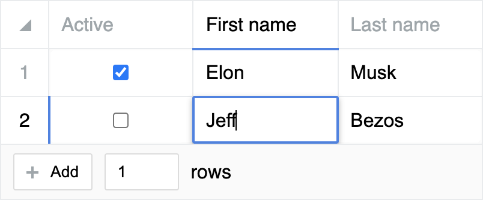

# @sage-bionetworks/react-datasheet-grid

A Sage Bionetworks fork of [nick-keller/react-datasheet-grid](https://github.com/nick-keller/react-datasheet-grid),
published to npm as `@sage-bionetworks/react-datasheet-grid` and consumed by
`synapse-react-client`.

The fork previously lived in its own repository at
[Sage-Bionetworks/react-datasheet-grid](https://github.com/sage-bionetworks/react-datasheet-grid);
its sources were migrated here from commit `96e0c33`, which remains the archive
for the pre-migration history.

View the upstream [demo and documentation](https://react-datasheet-grid.netlify.app/)

An Airtable-like / Excel-like component to create beautiful spreadsheets.



Feature rich:

- Dead simple to set up and to use
- Supports copy / pasting to and from Excel, Google-sheet...
- Keyboard navigation and shortcuts fully-supported
- Supports right-clicking and custom context menu
- Supports dragging corner to expand selection
- Easy to extend and implement custom widgets
- Blazing fast, optimized for speed, minimal renders count
- Smooth animations
- Virtualized rows and columns, supports hundreds of thousands of rows
- Extensively customizable, controllable behaviors
- Built with Typescript

## Install

```bash
npm i @sage-bionetworks/react-datasheet-grid
```

## Usage

```tsx
import {
  DataSheetGrid,
  checkboxColumn,
  textColumn,
  keyColumn,
} from '@sage-bionetworks/react-datasheet-grid'

// Import the style only once in your app!
import '@sage-bionetworks/react-datasheet-grid/dist/style.css'

const Example = () => {
  const [data, setData] = useState([
    { active: true, firstName: 'Elon', lastName: 'Musk' },
    { active: false, firstName: 'Jeff', lastName: 'Bezos' },
  ])

  const columns = [
    {
      ...keyColumn('active', checkboxColumn),
      title: 'Active',
    },
    {
      ...keyColumn('firstName', textColumn),
      title: 'First name',
    },
    {
      ...keyColumn('lastName', textColumn),
      title: 'Last name',
    },
  ]

  return <DataSheetGrid value={data} onChange={setData} columns={columns} />
}
```

## Development

```bash
pnpm nx run @sage-bionetworks/react-datasheet-grid:test         # vitest (src/ and tests/)
pnpm nx run @sage-bionetworks/react-datasheet-grid:example:dev  # demo app at example/
pnpm nx run @sage-bionetworks/react-datasheet-grid:e2e          # playwright specs in e2e/
```

`example/` is a small demo app that imports the grid from `../src`, and the
Playwright specs in `e2e/` drive it. Both exist to cover behavior that needs a
real browser — layout, scrolling, and cell expansion — which JSDOM cannot
measure.
