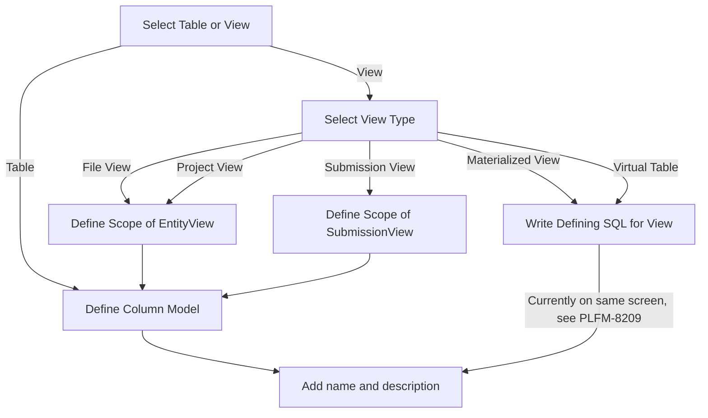

The following Mermaid diagram defines the general workflow of the Create Table Wizard:

```mermaid
flowchart TD
    CHOOSE_TABLE_TYPE[Select Table or View]
    CHOOSE_VIEW_TYPE[Select View Type]
    ENTITY_VIEW_SCOPE[Define Scope of EntityView]
    SUBMISSION_VIEW_SCOPE[Define Scope of SubmissionView]
    TABLE_SQL[Write Defining SQL for View]
    TABLE_COLUMNS[Define Column Model]
    TABLE_NAME[Add name and description]

    CHOOSE_TABLE_TYPE -->|Table| TABLE_COLUMNS
    CHOOSE_TABLE_TYPE -->|View| CHOOSE_VIEW_TYPE
    CHOOSE_VIEW_TYPE -->|File View| ENTITY_VIEW_SCOPE
    CHOOSE_VIEW_TYPE -->|Project View| ENTITY_VIEW_SCOPE
    CHOOSE_VIEW_TYPE -->|Submission View| SUBMISSION_VIEW_SCOPE
    CHOOSE_VIEW_TYPE -->|Materialized View| TABLE_SQL
    CHOOSE_VIEW_TYPE -->|Virtual Table| TABLE_SQL

    ENTITY_VIEW_SCOPE --> TABLE_COLUMNS
    SUBMISSION_VIEW_SCOPE --> TABLE_COLUMNS
    TABLE_COLUMNS --> TABLE_NAME
    TABLE_SQL -->|Currently on same screen, see PLFM-8209| TABLE_NAME
```
